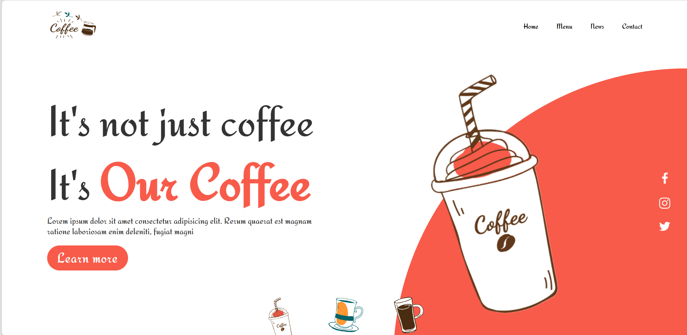
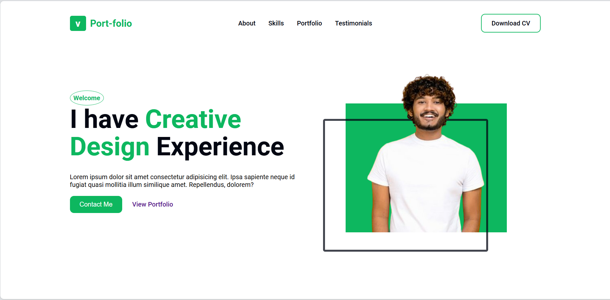
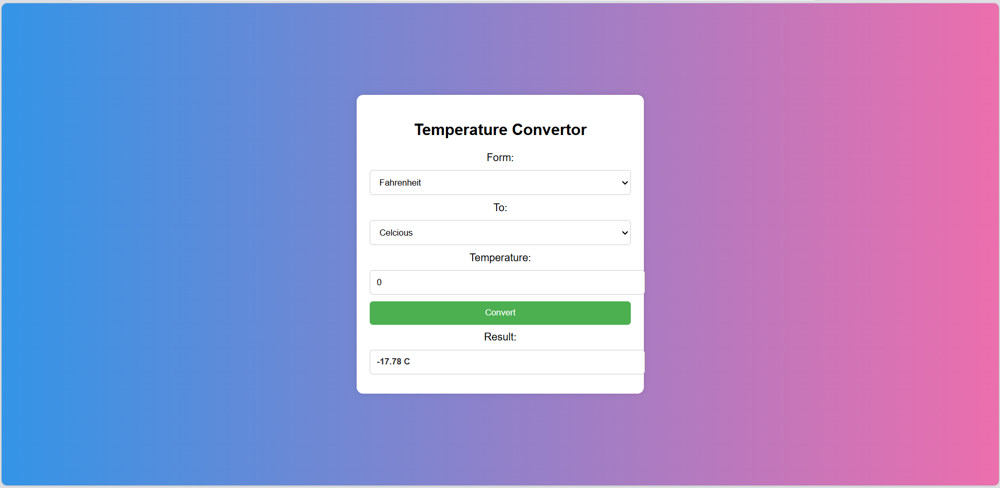

# Oasis Infobytes Web Development Tasks

This repository contains the web development tasks completed for Oasis Infobytes. Each task showcases a different aspect of front-end web development, including HTML, CSS, JavaScript, and responsive design.

## Table of Contents

- [Task 1: Coffee Website Landing Page](#task-1-coffee-website-landing-page)
- [Task 2: Portfolio Website](#task-2-portfolio-website)
- [Task 3: Temperature Converter Website](#task-3-temperature-converter-website)
- [Getting Started](#getting-started)
- [Technologies Used](#technologies-used)
- [Contact](#contact)

## Task 1: Coffee Website Landing Page

The first task is to create a landing page for a coffee shop. The website provides an attractive and user-friendly interface with a modern design to attract customers. It includes sections like the header, about, services, menu, testimonials, and contact.

### Features:
- **Responsive Design**: The landing page is designed to be responsive and adaptable to different screen sizes.
- **Dynamic Color Change**: Clicking on different thumbnails changes the background circle color, enhancing visual appeal. 
- **Navigation Bar**: A simple navigation bar that includes sections such as Home, Menu, News, and Contact.
 - **Engaging Hero Section**: A hero section with a captivating tagline, "It's not just coffee, it's Our Coffee," accompanied by a descriptive text and a call-to-action button. 
- **Social Media Integration**: Icons for Facebook, Instagram, and Twitter are provided for social media navigation. 
- **Logo and Branding**: Includes a logo section for brand identity.

### Demo


## Task 2: Portfolio Website

The second task is to build a personal portfolio website to showcase skills, projects, testimonials, and contact information. It is ideal for developers and designers to present their work and achievements.

### Features:
- **Responsive Navigation Bar**: A clean and responsive navigation bar that includes links to sections such as About, Skills, Portfolio, Testimonials, and Contact, with options to download the CV.
- **Hero Section with Introduction**: A welcoming hero section featuring an introduction, a header image, and a call to action for contacting or viewing the portfolio.
- **Skills Section**: Highlights skills with visually appealing cards that explain different services or expertise areas such as Visual Design, Design Prototype, and UX Research.
- **Portfolio Section**: Showcases a gallery of creative works and projects with a "Show More" button to display additional content.
- **Testimonials Slider**: A dynamic testimonial slider using the Swiper library to display client feedback and reviews, enhancing social proof.
- **Contact Form**: A functional contact form where users can enter their details (Full Name, Email, Phone Number, Budget, and Message) to discuss potential projects.
- **Footer with Social Media Links**: A footer section with copyright information and social media links for Facebook, Twitter, LinkedIn, and Google.
- **Animated Scroll and Swiper Integration**: The website uses libraries like ScrollReveal and Swiper to enhance user experience with smooth scrolling and interactive carousels.
- **Statistics Section**: Displays stats like the number of satisfied clients, completed projects, and reviews given to build credibility.
- **Downloadable CV**: Option to download the user's CV directly from the navigation or within the site content.

### Demo


## Task 3: Temperature Converter Website

The third task is to create a simple web application for converting temperatures between Celsius, Fahrenheit, Kelvin and Rankine. The website provides a user-friendly interface to input temperature values and select the desired conversion.

### Features:
 - **Conversion Options**: Allows conversion between four temperature units—Celsius, Fahrenheit, Kelvin, and Rankine. 
- **User Input and Selection**: Users can input a temperature value and select both "From" and "To" units from dropdown menus. 
- **Instant Conversion**: A "Convert" button triggers the conversion, providing instant results.
- **Result Display**: The converted temperature is displayed in a dedicated result field. 
- **Responsive Design**: The layout is clean and simple, ensuring it works well on various devices. 
- **Error Handling**: Handles user input to prevent errors during the conversion process.

### Demo


## Getting Started

To view these websites locally, follow these steps:

1. Clone the repository:
    ```bash
    git clone https://github.com/your-username/oasis-infobytes-tasks.git
    ```
2. Navigate to the project folder:
    ```bash
    cd oasis-infobytes-tasks
    ```
3. Open the `index.html` file of each task folder in your web browser.

## Technologies Used

- HTML5
- CSS3
- JavaScript
- Responsive Web Design

## Contact

For any inquiries or feedback, feel free to reach out:

- **Email**: mayanklakkewar.work@gmail.com
- **GitHub**: [mayanklakkewar](https://github.com/mayanklakkewar)

---

Feel free to fork this repository, open issues, or contribute!


